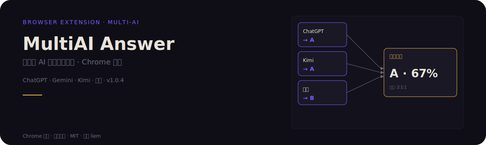
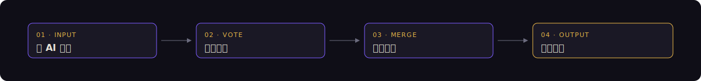

<p align="center">
  
</p>

## 投票面板与支持矩阵

MultiAI Answer 让多个 AI 模型对同一道题同时作答,再按权重投票选出最终答案并自动填写。下表是当前接入的 AI 平台与处理的题型,作为最直接的证明。

### 支持的 AI 平台

| 平台 | 默认权重建议 | 擅长方向 |
| --- | --- | --- |
| ChatGPT | 2 | 通用问答 / 长文本理解 |
| Gemini | 1 | 多模态 / 事实核查 |
| Kimi | 1 | 长上下文 / 中文阅读 |
| 通义千问 | 1 | 中文试题 / 学科知识 |
| DeepSeek | 1 | 推理 / 数学计算 |

权重为 0–10 的整数,数值越大在分歧时主导作用越强;设为 0 表示该模型仅作参考不参与投票。

### 支持的题型

| 题型 | 处理方式 |
| --- | --- |
| 单选题 | 多模型投票,取最高权重答案 |
| 多选题 | 各模型选项求并集,按权重筛选 |
| 填空题 | 多模型答案合并,取共识片段 |
| 判断题 | 投票 True / False |
| 简答题 | 多模型答案整合,可人工编辑 |
| 论述题 | 多模型大纲合并,可手动修订 |

## 它是什么

MultiAI Answer 是一个 Chrome 浏览器扩展,把多模型 AI 投票机制搬进答题页面,自动识别题型、调度多个 AI、整合答案并填写到题目输入框。

## 为什么不同

- **多模型投票,不是单 AI 答题**:同一道题并行发给 ChatGPT、Gemini、Kimi、通义、DeepSeek,各自返回答案后按权重投票,避免单一模型的盲区与幻觉。
- **可配置权重系统**:为每个模型设置 0–10 的权重,高权重模型在分歧时主导结果,低权重模型仅作参考,权重比例直接体现在投票结果中。
- **题型自动识别**:扩展根据题目结构判断单选 / 多选 / 填空 / 判断 / 简答 / 论述,选用对应的整合策略,而不是把所有题当简答题处理。
- **自动填写答案**:投票结果确定后,直接写入页面的单选框、复选框、文本域,无需手动复制粘贴。
- **解除复制粘贴限制**:对部分禁用右键 / 复制的答题页面解除限制,便于人工核对与修订。
- **AI 调试面板**:可查看每个模型的原始返回、置信度、投票明细,便于排查分歧来源。

## 工作流程

<p align="center">
  
</p>

1. **多 AI 并行**:扩展抓取题目后,同时调用已配置的 AI 模型,各自独立作答。
2. **权重投票**:按用户设置的权重对每个模型的答案计票,分歧时高权重模型主导。
3. **结果整合**:根据题型选择整合策略(投票 / 并集 / 合并 / 大纲),生成最终答案。
4. **自动填写**:把最终答案写入页面对应的输入控件,用户可随时覆盖或编辑。

## 如何使用

### 安装(5 步)

1. 下载仓库 ZIP 并解压到本地任意目录。
2. 打开 Chrome,地址栏输入 `chrome://extensions/`。
3. 右上角开启「开发者模式」。
4. 点击「加载已解压的扩展程序」,选择解压后的根目录。
5. 浏览器右上角出现 MultiAI Answer 图标,安装完成。

### 使用(4 步)

1. 进入题目页面,点击页面上的「整卷预览」让扩展抓取题目。
2. 点击浏览器工具栏的扩展图标,弹出面板显示题目列表。
3. 在「AI 配置」中选择启用的模型并设置权重(例如 ChatGPT=2,其他=1)。
4. 点击「显示 AI 答案」查看各模型回答,选择「自动整合」或手动编辑后,点击「自动填写」写入页面。

## 测试

在浏览器地址栏访问扩展自带的测试页:

```
chrome-extension://<你的扩展ID>/test/test.html
```

扩展 ID 可在 `chrome://extensions/` 页面对应卡片上找到。

## 隐私

- 扩展不在服务器存储任何题目、答案或账号信息。
- 题目内容仅发送到用户配置的 AI 平台 API,处理结果保存在本地。
- 不收集使用统计、不埋点、不上传遥测数据。

## 更新日志

### v1.0.4
- 新增多模型权重投票机制
- 新增题型自动识别(单选 / 多选 / 填空 / 判断 / 简答 / 论述)
- 新增 AI 调试面板,可查看各模型原始返回与投票明细
- 修复部分页面复制粘贴限制未解除的问题

## License

MIT License — 作者 liem
